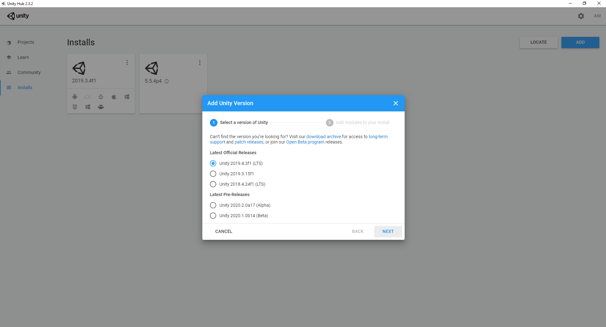
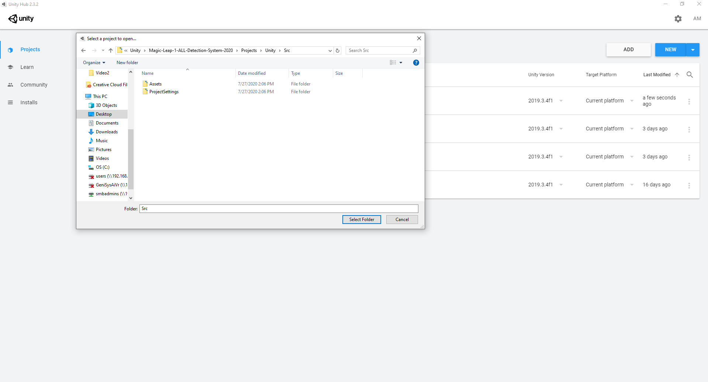
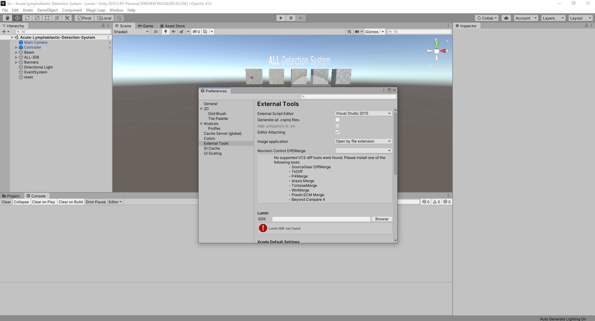
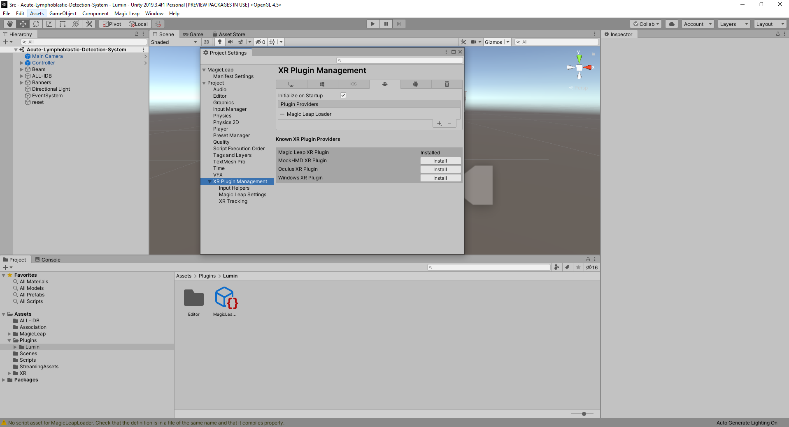
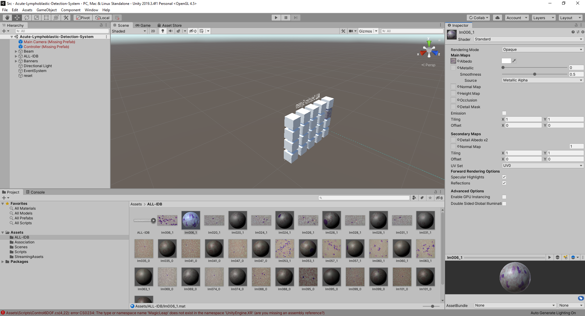

# Peter Moss Acute Myeloid & Lymphoblastic Leukemia AI Research Project Project
## Acute Lymphoblastic Leukemia Detection System For Magic Leap 1
### Unity

[](https://github.com/AMLResearchProject/Magic-Leap-1-ALL-Detection-System-2020)

&nbsp;

# Table Of Contents

- [Introduction](#introduction)
- [Required Hardware](#required-hardware)
- [Prerequisites](#prerequisites)
  - [HIAS Server](#hias-server)
  - [Acute Lymphoblastic Leukemia Tensorflow CNN](#acute-lymphoblastic-leukemia-tensorflow-cnn)
  - [Acute Lymphoblastic Leukemia Tensorflow CNN For Raspberry Pi 4](#acute-lymphoblastic-leukemia-tensorflow-cnn-for-raspberry-pi-4)
  - [Clone the repository](#clone-the-repository)
    - [Developer Forks](#developer-forks)
- [Installation](#installation)
    - [Magic Leap Basics](#magic-leap-basics)
    - [Unity 2019.3.4f1](#unity-201934f1)
    - [Magic Leap 1](#magic-leap-1)
- [Continue](#continue)
- [Contributing](#contributing)
  - [Contributors](#contributors)
- [Versioning](#versioning)
- [License](#license)
- [Bugs/Issues](#bugs-issues)

&nbsp;

# Introduction

The following guide will take you through setting up and installing the [ Acute Lymphoblastic Leukemia Detection System For Magic Leap 1](https://github.com/AMLResearchProject/Magic-Leap-1-ALL-Detection-System-2020/tree/master/Projects/Unity " Acute Lymphoblastic Leukemia Detection System For Magic Leap 1").

&nbsp;

# Required Hardware

- [Magic Leap 1](https://www.magicleap.com/en-us/magic-leap-1 "Magic Leap 1")
- VR Ready Laptop / PC / Mac

&nbsp;

# Prerequisites

Before you can install the Acute Lymphoblastic Leukemia Detection System For Magic Leap 1, there are some prerequisites. 

## HIAS Server

If you are going to be using the full system you will need to install the [HIAS](https://github.com/LeukemiaAiResearch/HIAS "HIAS") server. Follow the [HIAS Installation Guide](https://github.com/LeukemiaAiResearch/HIAS/blob/master/Documentation/Installation/Installation.md "HIAS Installation Guide") to complete your HIAS server setup. 

If you chose not to use the full system, steps are provided in this tutorial that will allow you to use the system without a HIAS installation.

## Acute Lymphoblastic Leukemia Tensorflow CNN

If you want to train your own Artificial Intelligence required to detect COVID-19, you will need to complete the [Acute Lymphoblastic Leukemia Tensorflow CNN](https://github.com/AMLResearchProject/ALL-Tensorflow-2020/tree/master/CNN) tutorial. If you would like to use the pre-trained model we have provided, you can skip to the next step.

**YOU MUST USE THE SAME TRAIN AND TEST DATA AS THE TUTORIAL SPECIFIES**  
The test data provided in the Acute Lymphoblastic Leukemia Detection System For Magic Leap 1 requires the same model to be used. 

## Acute Lymphoblastic Leukemia Tensorflow CNN For Raspberry Pi 4

The Acute Lymphoblastic Leukemia Tensorflow CNN For Raspberry Pi 4 hosts a local server on a RPI4 allowing images to be classified remotely. In this project we use the AI model trained in the **Acute Lymphoblastic Leukemia Tensorflow CNN**, but we also provide the pre-trained model so that you can use the classifier "out of the box". 

Regardless of whether you choose to train your own model or use the pre-trained model, you will need to complete the [Acute Lymphoblastic Leukemia Tensorflow CNN For Raspberry Pi 4](https://github.com/AMLResearchProject/ALL-Tensorflow-2020/tree/master/RPI4) tutorial as this is the project that creates the classifier that the Magic Leap 1 will interact with. 

## Clone the repository

Clone the [Magic Leap 1 Acute Lymphoblastic Leukemia Detection System](https://github.com/AMLResearchProject/Magic-Leap-1-ALL-Detection-System-2020 " Magic Leap 1 Acute Lymphoblastic Leukemia Detection System") repository from the [Peter Moss Acute Myeloid & Lymphoblastic Leukemia AI Research Project](https://github.com/AMLResearchProject "Peter Moss Acute Myeloid & Lymphoblastic Leukemia AI Research Project") Github Organization.

To clone the repository and install the Acute Lymphoblastic Leukemia Tensorflow CNN For Raspberry Pi 4, make sure you have Git installed. Now navigate to the home directory on your device using terminal/commandline, and then use the following command.

```
$ git clone https://github.com/AMLResearchProject/Magic-Leap-1-ALL-Detection-System-2020.git
```

Once you have used the command above you will see a directory called **Magic-Leap-1-ALL-Detection-System-2020** in your home directory.

```
ls
```

Using the ls command in your home directory should show you the following.

```
Magic-Leap-1-ALL-Detection-System-2020
```

Navigate to **Magic-Leap-1-ALL-Detection-System-2020/Projects/Unity** directory, this is your project root directory for this tutorial.

### Developer Forks

Developers from the Github community that would like to contribute to the development of this project should first create a fork, and clone that repository. For detailed information please view the [CONTRIBUTING](../../../CONTRIBUTING.md "CONTRIBUTING") guide. You should pull the latest code from the development branch.

```
  $ git clone -b "0.2.0" https://github.com/AMLResearchProject/Magic-Leap-1-ALL-Detection-System-2020.git
```

The **-b "0.2.0"** parameter ensures you get the code from the latest master branch. Before using the below command please check our latest master branch in the button at the top of the project README.

&nbsp;

# Installation

Below you will find the steps required to setup for Magic Leap development.

## Magic Leap Basics

Follow the [Magic Leap Developer Setup](https://developer.magicleap.com/en-us/learn/guides/develop-setup "Magic Leap Developer Setup") guide to install the required Magic Leap development tools.

## Unity 2019.3.4f1

For Magic Leap apps you need Unity 2019.3.4f1. Head to the [Unity 2019.3.4](https://unity3d.com/unity/whats-new/2019.3.4 "Unity 2019.3.4") page and download and install the **Lumin Target Support** exe. 

Open **Magic Leap's Lab** and click on the **Launch** button for **Unity Hub**.

[](https://developer.magicleap.com/en-us/learn/guides/lab)

Unity Hub will now open. 



Go to the **Installs** tab in Unity Hub and select **Unity 2019.3.4f1 (LTS)**, click next and continue until Unity 2019.3.4f1 (LTS) is installed.



Click on the **ADD** button. This will open Windows Explorer allowing you to navigate to the project and import it. 

To import Acute Lymphoblastic Leukemia Detection System For Magic Leap 1 into Unity Hub, navigate to the **Magic-Leap-1-ALL-Detection-System-2020/Src** directory and click **Select Folder**.

Now open the project by double clicking on it, if you get a warning, click Continue. 

Now follow the [Magic Leap Unity Setup](https://developer.magicleap.com/en-us/learn/guides/get-started-developing-in-unity) guide. When you get to the **Unity Project Setup** skip the rest of the tutorial and follow the steps here below.

In Unity, open **File->Build Settings** and change the target to **Lumin** if not already done.



Now go to **Edit->Preferences** and head to the **Lumin** section. You now need to use the browse button to navigate to your version of the Lumin SDK. It should be in the path **C:/Users/YourUser/MagicLeap/mlsdk/v0.24.1**.

In Unity import the Magic Leap package from the project template you just donwload by clicking **Assets->Import Package->Custom Package**. Now in the file explorer that opens, navigate to **C:\Users\YOUR_USER\MagicLeap\tools\unity\v0.24.2** and double click on the **MagicLeap-Tools.unitypackage** file.


Next go to **Edit->Project Settings**, click on **XR Settings** and click on **Install Legacy Input Helpers Package** as shown above.



Now you need to set the plugin providers for both Windows and Magic Leap. Go to **Project Settings->XR Plugin Management** and click on the **+** sign in **Plugin Providers** in both the Windows and Magic Leap tabs and add **Magic Leap Loader**.

Go to **Magic Leap->ML Remote** and click on **Import Support Libraries** then click on **Launch Zero Iteration**.

Next you need to add your Magic Leap certificate. Follow the [Get a Developer Certificate](https://developer.magicleap.com/en-us/learn/guides/developer-certificates "Get a Developer Certificate") guide on Magic Leap's website. 

Once you have your certificate you need to add it to your Unity project. Go to **Edit->Project Settings->Publish Settings** and click **Sign Package** then click the button **...** to open Explorer, navigate to the location you saved your certificate to and select the folder.

## Install ALL-IDB 1
Now you need to install the ALL-IDB 1 data into the application. Remember, you must use the same test data that was specified in the [Acute Lymphoblastic Leukemia Tensorflow CNN](https://github.com/AMLResearchProject/ALL-Tensorflow-2020/tree/master/CNN "Acute Lymphoblastic Leukemia Tensorflow CNN") tutorial. 



Navigate to the **ALL-IDB** folder in the **Assets** folder in Unity. Now drag the test data into the ALL-IDB folder. Click on each material in the folder and drag the corresponding data file to the square to the left of the **Albedo** setting in the **Inspector** area to the right of the IDE as shown above. 

Final drag the test data into the **StreamingAssets** folder also.

&nbsp;

# Magic Leap 1

You now need to setup your device for development. Power up your Magic Leap 1 and head to  **Settings->Device->Developer Mode**. You need to **Enable Developer Mode**, **Allow Untrusted Sources**, and **Enable MLDB Access**.

# Continue

You are now ready to continue with the [Unity](../../Unity/ "Unity") tutorial to take the final steps in getting your application running.

&nbsp;

# Contributing

The Peter Moss Acute Myeloid & Lymphoblastic Leukemia AI Research Project Project encourages and welcomes code contributions, bug fixes and enhancements from the Github.

Please read the [CONTRIBUTING](../../../CONTRIBUTING.md "CONTRIBUTING") document for a full guide to forking our repositories and submitting your pull requests. You will also find information about our code of conduct on this page.

## Contributors

- [Adam Milton-Barker](https://www.leukemiaresearchassociation.ai/team/adam-milton-barker "Adam Milton-Barker") - [Asociacion De Investigacion En Inteligencia Artificial Para La Leucemia Peter Moss](https://www.leukemiaresearchassociation.ai "Asociacion De Investigacion En Inteligencia Artificial Para La Leucemia Peter Moss") President & Lead Developer, Sabadell, Spain

&nbsp;

# Versioning

We use SemVer for versioning. For the versions available, see [Releases](../../../releases "Releases").

&nbsp;

# License

This project is licensed under the **MIT License** - see the [LICENSE](../../../LICENSE "LICENSE") file for details.

&nbsp;

# Bugs/Issues

We use the [repo issues](../../../issues "repo issues") to track bugs and general requests related to using this project. See [CONTRIBUTING](../../../CONTRIBUTING.md "CONTRIBUTING") for more info on how to submit bugs, feature requests and proposals.


