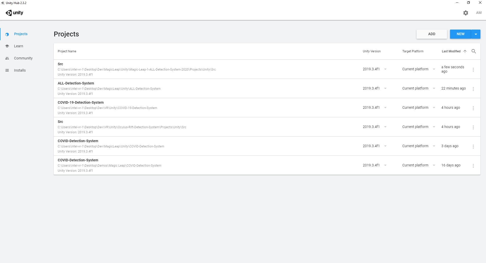
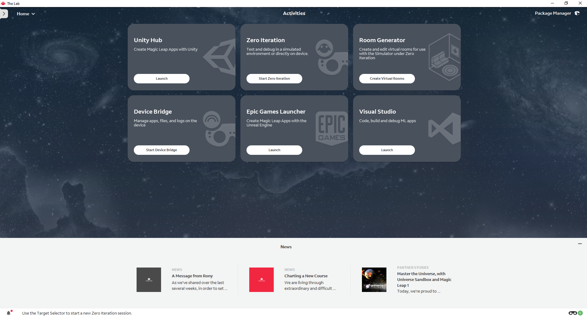
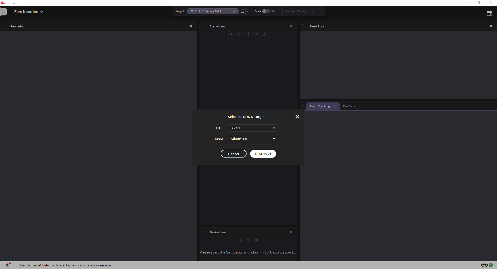
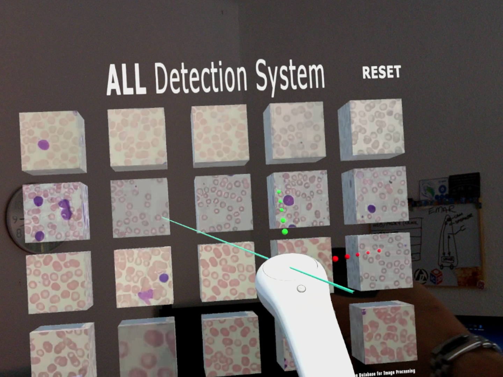
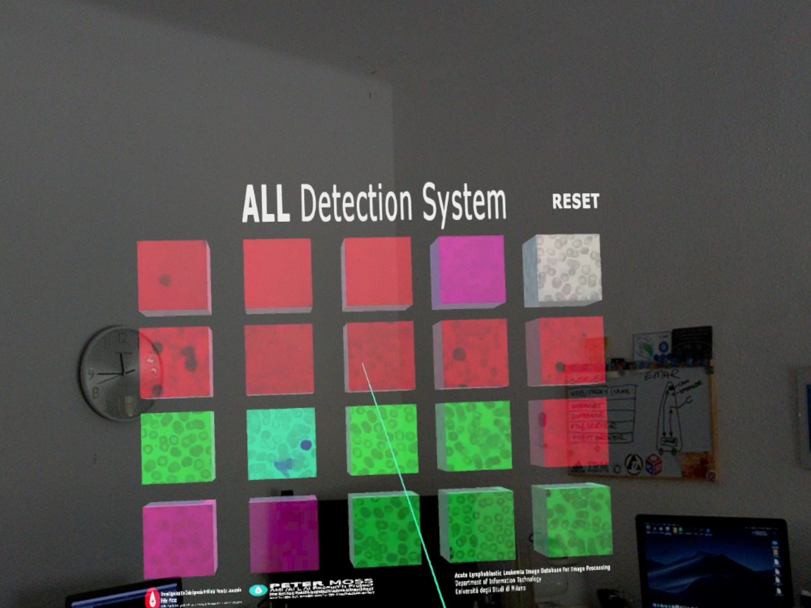

# Peter Moss COVID-19 AI Research Project
## Acute Lymphoblastic Leukemia Detection System For Magic Leap 1
### Unity

&nbsp;

# Table Of Contents

- [Introduction](#introduction)
- [DISCLAIMER](#disclaimer)
- [Prerequisites](#prerequisites)
  - [HIAS Server](#hias-server)
  - [ALL-IDB](#all-idb)
  - [Acute Lymphoblastic Leukemia Tensorflow CNN](#acute-lymphoblastic-leukemia-tensorflow-cnn)
  - [Acute Lymphoblastic Leukemia Tensorflow CNN For Raspberry Pi 4](#acute-lymphoblastic-leukemia-tensorflow-cnn-for-raspberry-pi-4)
- [Installation](#installation)
- [Useage](#useage)
  - [Unity Hub](#unity-hub)
  - [Device Bridge](#device-bridge)
  - [Zero Iteration](#zero-iteration)
  - [Classification Server](#classification-server)
  - [Run The App](#run-the-app)
- [Contributing](#contributing)
  - [Contributors](#contributors)
- [Versioning](#versioning)
- [License](#license)
- [Bugs/Issues](#bugs-issues)

&nbsp;

# Introduction

The Acute Lymphoblastic Leukemia Detection System For Magic Leap 1 2020 uses Tensorflow 2, Raspberry Pi 4 & Magic Leap 1 to provide a Spatial Computing detection system for Acute Lymphoblastic Leukemia. 

The project uses the [Acute Lymphoblastic Leukemia Tensorflow CNN](https://github.com/AMLResearchProject/ALL-Tensorflow-2020/tree/master/CNN "Acute Lymphoblastic Leukemia Tensorflow CNN") a Tensorflow implementation of DenseNet and the [Acute Lymphoblastic Leukemia Image Database for Image Processing dataset](https://homes.di.unimi.it/scotti/all "Acute Lymphoblastic Leukemia Image Database for Image Processing dataset").

We use the trained model from **Acute Lymphoblastic Leukemia Tensorflow CNN** with the [Acute Lymphoblastic Leukemia Tensorflow CNN For Raspberry Pi 4](https://github.com/AMLResearchProject/ALL-Tensorflow-2020/tree/master/RPI4 "Acute Lymphoblastic Leukemia Tensorflow CNN For Raspberry Pi 4") and serve an API endpoint that exposes the Artificial Intelligence classifier allowing **Magic Leap 1** to communicate with it.

&nbsp;

# DISCLAIMER

This project should be used for research purposes only. The purpose of the project is to show the potential of Spatial Computing, Artificial Intelligence, and the Internet of Things for medical support systems such as diagnosis systems. 

Although the classifier used in this project is very accurate and shows good results both on paper and in real world testing, it is not meant to be an alternative to professional medical diagnosis.

Developers that have contributed to this repository have experience in using Artificial Intelligence for detecting certain types of cancer & COVID-19. They are not a doctors, medical or cancer experts. Please use these systems responsibly.

&nbsp;

# Prerequisites

Before you can install the Acute Lymphoblastic Leukemia Detection System For Magic Leap 1, there are some prerequisites. 

## HIAS Server

If you are going to be using the full system you will need to install the [HIAS](https://github.com/LeukemiaAiResearch/HIAS "HIAS") server. Follow the [HIAS Installation Guide](https://github.com/LeukemiaAiResearch/HIAS/blob/master/Documentation/Installation/Installation.md "HIAS Installation Guide") to complete your HIAS server setup. 

If you chose not to use the full system, steps are provided in this tutorial that will allow you to use the system without a HIAS installation. 

## ALL-IDB

You need to be granted access to use the Acute Lymphoblastic Leukemia Image Database for Image Processing dataset. You can find the application form and information about getting access to the dataset on [this page](https://homes.di.unimi.it/scotti/all/#download) as well as information on how to contribute back to the project [here](https://homes.di.unimi.it/scotti/all/results.php). If you are not able to obtain a copy of the dataset please feel free to try this tutorial on your own dataset, we would be very happy to find additional AML & ALL datasets.

## Acute Lymphoblastic Leukemia Tensorflow CNN

If you want to train your own Artificial Intelligence required to detect COVID-19, you will need to complete the [Acute Lymphoblastic Leukemia Tensorflow CNN](https://github.com/AMLResearchProject/ALL-Tensorflow-2020/tree/master/CNN) tutorial. If you would like to use the pre-trained model we have provided, you can skip to the next step.

**YOU MUST USE THE SAME TRAIN AND TEST DATA AS THE TUTORIAL SPECIFIES**  
The test data provided in the Acute Lymphoblastic Leukemia Detection System For Magic Leap 1 requires the same model to be used. 

## Acute Lymphoblastic Leukemia Tensorflow CNN For Raspberry Pi 4

The Acute Lymphoblastic Leukemia Tensorflow CNN For Raspberry Pi 4 hosts a local server on a RPI4 allowing images to be classified remotely. In this project we use the AI model trained in the **Acute Lymphoblastic Leukemia Tensorflow CNN**, but we also provide the pre-trained model so that you can use the classifier "out of the box". 

Regardless of whether you choose to train your own model or use the pre-trained model, you will need to complete the [Acute Lymphoblastic Leukemia Tensorflow CNN For Raspberry Pi 4](https://github.com/AMLResearchProject/ALL-Tensorflow-2020/tree/master/RPI4) tutorial as this is the project that creates the classifier that the Magic Leap 1 will interact with. 

&nbsp;

# Installation

Please follow the [Installation Guide](Documentation/Installation.md) to install Acute Lymphoblastic Leukemia Detection System For Magic Leap 1.

&nbsp;

# Useage

After following the installation guide you should now have all of the required tools installed. Use the following guides to start using the **Acute Lymphoblastic Leukemia Detection System For Magic Leap 1**.

## Unity Hub

Open **Magic Leap's Lab** and click on the **Launch** button for **Unity Hub**.

Once you have done this you can open the project in Unity by clicking on it. 

## Device Bridge

Now you need to setup your Magic Leap 1 device in [Device Bridge](https://developer.magicleap.com/en-us/learn/guides/magic-leap-device-bridge-reference "Device Bridge"). To do this first turn on your Magic Leap device and open your world. Make sure you are in the center of your room and facing the way you want your app to open.

Once turned on and inside your world, you need to attach your Magic Leap 1 to your computer using the USB type C  connector. 

Now head to Device Bridge in Lab. You should see the above in Device Bridge.

Click on the **WiFi Bridge** button to activate WiFi, Device Bridge will reload and you should see the IP assigned to your device. This means that your PC is now bridged to the Magic Leap 1 device via WiFi.

## Zero Iteration

[Zero Iteration](https://developer.magicleap.com/en-us/learn/guides/lab-zi "Zero Iteration") allows you to run your apps directly on the Magic Leap 1 device. Providing you have followed the above steps, open Zero Iterator from the Lab homepage, select your device, and restart the program. 

## Classification Server

Now you need to make sure that your **Acute Lymphoblastic Leukemia Tensorflow CNN For Raspberry Pi 4** is running in **Server** mode and waiting for requests.

## Run The App

Now you are ready to fire up the Acute Lymphoblastic Leukemia Detection System For Magic Leap 1! 

Head over to Unity and click on the play button. You can remove the cable connection and move to the center of your room. You should now see the Acute Lymphoblastic Leukemia Detection System For Magic Leap 1 in your view. 

Now use your controller to hit the blocks by pointing the laser at the blocks. This will send the relevant image to the server for classification. 

The server will return the response to the Magic Leap 1 and the color of the block will change. 

- **RED** Specifies a true positive (ALL positive)
- **GREEN** Specifies a true negative (ALL negative)
- **Magento** Specifies a false positive (ALL negative but classifier determined ALL positive)
- **Cyan** Specifies a false negative (ALL positive but classifier determined ALL negative)

You can reset the application by hitting the **RESET** button with the laser.

&nbsp;

# Contributing

The Peter Moss Acute Myeloid & Lymphoblastic Leukemia AI Research Project encourages and welcomes code contributions, bug fixes and enhancements from the Github.

Please read the [CONTRIBUTING](../../CONTRIBUTING.md "CONTRIBUTING") document for a full guide to forking our repositories and submitting your pull requests. You will also find information about our code of conduct on this page.

## Contributors

- [Adam Milton-Barker](https://www.leukemiaresearchassociation.ai/team/adam-milton-barker "Adam Milton-Barker") - [Asociacion De Investigacion En Inteligencia Artificial Para La Leucemia Peter Moss](https://www.leukemiaresearchassociation.ai "Asociacion De Investigacion En Inteligencia Artificial Para La Leucemia Peter Moss") President & Lead Developer, Sabadell, Spain

&nbsp;

# Versioning

We use SemVer for versioning. For the versions available, see [Releases](../../releases "Releases").

&nbsp;

# License

This project is licensed under the **MIT License** - see the [LICENSE](../../LICENSE "LICENSE") file for details.

&nbsp;

# Bugs/Issues

We use the [repo issues](../../issues "repo issues") to track bugs and general requests related to using this project. See [CONTRIBUTING](../../CONTRIBUTING.md "CONTRIBUTING") for more info on how to submit bugs, feature requests and proposals.