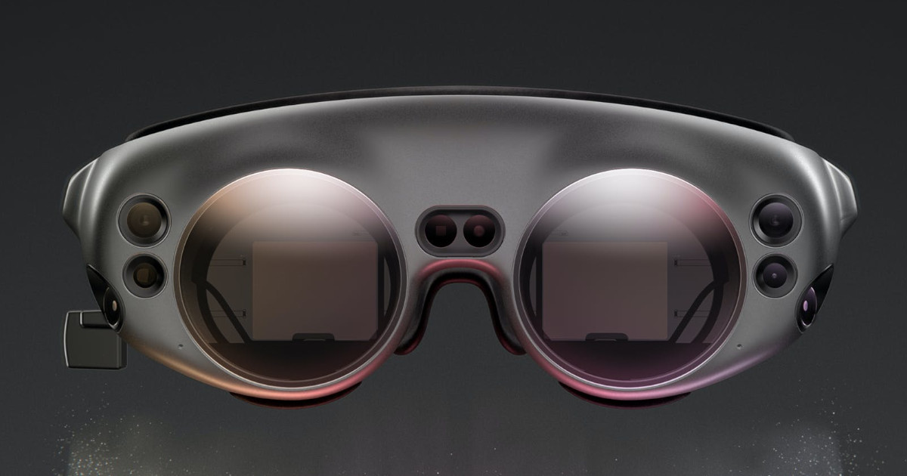

# Peter Moss Acute Myeloid & Lymphoblastic Leukemia AI Research Project
## Magic Leap 1 Acute Lymphoblastic Leukemia Detection System

      

&nbsp;

# Table Of Contents

- [Introduction](#introduction)
- [DISCLAIMER](#disclaimer)
- [About Magic Leap 1](#about-magic-leap-1)
- [About Unity 3D](#about-unity-3d)
- [ALL-IDB](#all-idb)
    - [ALL_IDB1](#all_idb1)
- [Projects](#projects)
- [Contributing](#contributing)
  - [Contributors](#contributors)
- [Versioning](#versioning)
- [License](#license)
- [Bugs/Issues](#bugs-issues)

&nbsp;

# Introduction

The Magic Leap 1 Acute Lymphoblastic Leukemia Detection System 2020 uses Tensorflow 2, Raspberry Pi 4 & Magic Leap 1 to provide a spatial computing detection system.

We use the trained model from **oneAPI Acute Lymphoblastic Leukemia Classifier** with the [OneAPI OpenVINO Raspberry Pi 4 Acute Lymphoblastic Leukemia Classifier](https://github.com/AMLResearchProject/oneAPI-ALL-Classifier/tree/master/RPI4 "OneAPI OpenVINO Raspberry Pi 4 Acute Lymphoblastic Leukemia Classifier") and serve an API endpoint that exposes the Artificial Intelligence classifier allowing **Magic Leap 1** to communicate with it.

&nbsp;

# DISCLAIMER

These projects should be used for research purposes only. The purpose of the projects are to show the potential of Spatial Computing, Artificial Intelligence, and the Internet of Things for medical support systems such as diagnosis systems.

Although the classifier used in this project is very accurate and shows good results both on paper and in real world testing, it is not meant to be an alternative to professional medical diagnosis.

Developers that have contributed to this repository have experience in using Artificial Intelligence for detecting certain types of cancer & COVID-19. They are not a doctors, medical or cancer/COVID-19 experts. Please use these systems responsibly.

&nbsp;

# About Magic Leap 1

This project uses the revolutionary Magic Leap 1 and Magic Leap's Spatial Computing Environment. Magic Leap 1 is a lightweight headset that uses Spatial Computing to map out rooms allowing applications to understand their enviroment and to interact accordingly.

To develop applications for Magic Leap 1 we use the [Magic Leap Lab](https://developer.magicleap.com/downloads "Magic Leap Lab") which allows us to use [Lumin SDK](https://developer.magicleap.com/en-us/learn/guides/lumin-sdk-latest-release-notes "Lumin SDK"), Lumin Runtime editor, and SDK packages for [Unity Software](https://unity.com/ "Unity Software") and [Unreal Editor](https://www.unrealengine.com/en-US/ "Unreal Editor").

**We would like to thank Magic Leap for sponsoring our association with the Magic Leap 1. This is just one of the many medical applications we will be building with Magic Leap to assist in the fight against Leukemia.**

We would also like to thank Rodney at Magical Light and Sound for personally taking his time to help us get off the ground with using the Unity development platform with Magic Leap. You can follow his tutorials on his [Github](https://github.com/magicallightandsound "Github") and [Twitch](https://www.twitch.tv/rodneydeveloper "Twitch").

&nbsp;

# About Unity 3D

This project uses [Unity 3d](https://unity.com/ "Unity 3d"), a real-time 3D development platform. Combined with the [Lumin SDK](https://developer.magicleap.com/en-us/learn/guides/lumin-sdk-latest-release-notes "Lumin SDK"), Unity allows you to create breath taking, next generation projects for the Magic Leap Spatial Computing Environment.

&nbsp;

# ALL-IDB

You need to be granted access to use the Acute Lymphoblastic Leukemia Image Database for Image Processing dataset. You can find the application form and information about getting access to the dataset on [this page](https://homes.di.unimi.it/scotti/all/#download) as well as information on how to contribute back to the project [here](https://homes.di.unimi.it/scotti/all/results.php). If you are not able to obtain a copy of the dataset please feel free to try this tutorial on your own dataset, we would be very happy to find additional AML & ALL datasets.

## ALL_IDB1

In this project, [ALL-IDB1](https://homes.di.unimi.it/scotti/all/#datasets) is used, one of the datsets from the Acute Lymphoblastic Leukemia Image Database for Image Processing dataset. We will use data augmentation to increase the amount of training and testing data we have.

"The ALL_IDB1 version 1.0 can be used both for testing segmentation capability of algorithms, as well as the classification systems and image preprocessing methods. This dataset is composed of 108 images collected during September, 2005. It contains about 39000 blood elements, where the lymphocytes has been labeled by expert oncologists. The images are taken with different magnifications of the microscope ranging from 300 to 500."

&nbsp;

# Projects

Below you will find details of the projects in this repository. Projects with HIAS = YES are compatible with [HIAS](https://github.com/LeukemiaAiResearch/HIAS "HIAS").

| ID  | Platform                                                                                                    | Description                                                                                                                                                                                                                                                                                                                                                                                                                                                                                                                                 | HIAS | Author                                                                                                        |
| --- | ---------------------------------------------------------------------------------------------------------- | ------------------------------------------------------------------------------------------------------------------------------------------------------------------------------------------------------------------------------------------------------------------------------------------------------------------------------------------------------------------------------------------------------------------------------------------------------------------------------------------------------------------------------------------- | ---- | ------------------------------------------------------------------------------------------------------------- |
| 1   | [Unity](Projects/Unity/ "Unity") | The Magic Leap 1 Acute Lymphoblastic Leukemia Detection System built using the Unity 3D Development Platform.                                                                                                                                                                                                                                                                                                   | YES   |  [Adam Milton-Barker](https://www.leukemiaresearchassociation.ai/team/adam-milton-barker "Adam Milton-Barker") |

&nbsp;

# Contributing

The Peter Moss Acute Myeloid & Lymphoblastic Leukemia AI Research Project encourages and welcomes code contributions, bug fixes and enhancements from the Github.

Please read the [CONTRIBUTING](CONTRIBUTING.md "CONTRIBUTING") document for a full guide to forking our repositories and submitting your pull requests. You will also find information about our code of conduct on this page.

## Contributors

- [Adam Milton-Barker](https://www.leukemiaresearchassociation.ai/team/adam-milton-barker "Adam Milton-Barker") - [Asociacion De Investigacion En Inteligencia Artificial Para La Leucemia Peter Moss](https://www.leukemiaresearchassociation.ai "Asociacion De Investigacion En Inteligencia Artificial Para La Leucemia Peter Moss") President & Lead Developer, Sabadell, Spain

&nbsp;

# Versioning

We use SemVer for versioning.

&nbsp;

# License

This project is licensed under the **MIT License** - see the [LICENSE](LICENSE.md "LICENSE") file for details.

&nbsp;

# Bugs/Issues

We use the [repo issues](issues "repo issues") to track bugs and general requests related to using this project. See [CONTRIBUTING](CONTRIBUTING.md "CONTRIBUTING") for more info on how to submit bugs, feature requests and proposals.